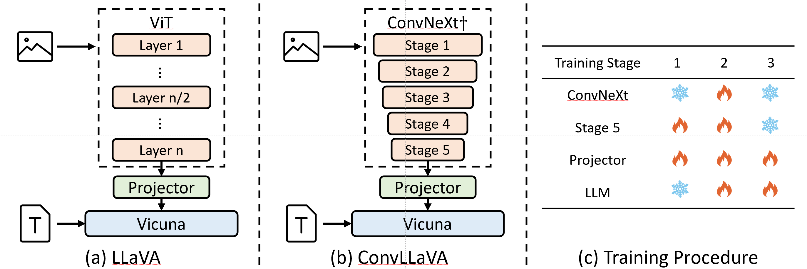

<div align="center">

<h2><a href="https://github.com/alibaba/conv-llava">ConvLLaVA: Hierarchical Backbones as Visual Encoder for Large Multimodal Models</a></h2>

[Chunjiang Ge](https://john-ge.github.io/), [Sijie Cheng](https://adacheng.github.io/), Ziming Wang, Jiale Yuan, Yuan Gao, Jun Song, Shiji Song, [Gao Huang](https://www.gaohuang.net/), Bo Zheng

</div>

<p align="center">
    <a href="https://arxiv.org/abs/"> 
        
    </a>
    <a href="https://huggingface.co/collections/ConvLLaVA/convllava-66519ef0ccdee62544bd19bf"> 
        
    </a>
    <a href="https://modelscope.cn/organization/ConvLLaVA?tab=model"> 
        
    </a>
    <a href="https://wisemodel.cn/organization/ConvLLaVA"> 
        
    </a>
    <a href="https://github.com/alibaba/conv-llava/stargazers">
        
    </a>
</p>

<!-- <span>[ English | <a href="README_zh.md">中文</a> ]</span> -->

## Overview

<div align="center">
  
</div>
<div align="center">
  <figcaption>Comparison between LLaVA and ConvLLaVA.</figcaption>
</div>

## Release

- [05/25] Checkpoints are released.
- [04/17] Our code is released.

We are developing ConvLLaVA-V2. If you are interested or you have great ideas, please feel free to email with me: [Chunjiang Ge](gecj20@mails.tsinghua.edu.cn).

[](https://github.com/tatsu-lab/stanford_alpaca/blob/main/LICENSE)
**Usage and License Notices**: This project utilizes certain datasets and checkpoints that are subject to their respective original licenses. Users must comply with all terms and conditions of these original licenses, including but not limited to the [OpenAI Terms of Use](https://openai.com/policies/terms-of-use) for the dataset and the specific licenses for base language models for checkpoints trained using the dataset (e.g. [Llama community license](https://ai.meta.com/llama/license/) for LLaMA-2 and Vicuna-v1.5). This project does not impose any additional constraints beyond those stipulated in the original licenses. Furthermore, users are reminded to ensure that their use of the dataset and checkpoints is in compliance with all applicable laws and regulations.


## Contents
- [Overview](#overview)
- [Release](#release)
- [Contents](#contents)
- [TODO](#todo)
- [Install](#install)
- [Model Zoo](#model-zoo)
- [Dataset](#dataset)
- [Train](#train)
- [Evaluation](#evaluation)
- [Citation](#citation)
- [Acknowledgement](#acknowledgement)

## TODO

- [ ] Add [LMMs-eval](https://github.com/EvolvingLMMs-Lab/lmms-eval) supports.
- [ ] Add [VLMEvalKit](https://github.com/open-compass/VLMEvalKit) supports.
- [ ] Add [xtuner](https://github.com/InternLM/xtuner) supports.
- [x] Release weights.
- [ ] Release inference code.

## Install

1. Clone this repository and navigate to ConvLLaVA folder
```bash
git clone https://github.com/alibaba/conv-llava
cd conv-llava
```

1. Install Package
```Shell
conda create -n convllava python=3.10 -y
conda activate convllava
pip install --upgrade pip  # enable PEP 660 support
pip install -e .
```

3. Install additional packages for training cases
```
pip install -e ".[train]"
pip install flash-attn --no-build-isolation
```

## Model Zoo

The performance on mainstream benchmarks are shown below:

<table class="tg"><thead>
  <tr>
    <th class="tg-nrix">Method</th>
    <th class="tg-nrix">Resolution</th>
    <th class="tg-nrix">Visual Tokens</th>
    <th class="tg-nrix">LLM</th>
    <th class="tg-nrix">MME</th>
    <th class="tg-nrix">MMB</th>
    <th class="tg-nrix">SEED</th>
    <th class="tg-nrix">RealWorldQA</th>
    <th class="tg-nrix">MMMU</th>
    <th class="tg-nrix">MMVet</th>
    <th class="tg-nrix">Text</th>
    <th class="tg-nrix">Doc</th>
    <th class="tg-nrix">POPE</th>
  </tr></thead>
<tbody>
  <tr>
    <td class="tg-nrix">ConvLLaVA</td>
    <td class="tg-nrix">768</td>
    <td class="tg-nrix">144</td>
    <td class="tg-nrix">7B</td>
    <td class="tg-nrix">1541</td>
    <td class="tg-nrix">68</td>
    <td class="tg-nrix">68.8</td>
    <td class="tg-nrix">55.9</td>
    <td class="tg-nrix">36.3</td>
    <td class="tg-nrix">44.8</td>
    <td class="tg-nrix">59.1</td>
    <td class="tg-nrix">44.8</td>
    <td class="tg-nrix">87.3</td>
  </tr>
  <tr>
    <td class="tg-nrix">ConvLLaVA</td>
    <td class="tg-nrix">1024</td>
    <td class="tg-nrix">256</td>
    <td class="tg-nrix">7B</td>
    <td class="tg-nrix">1553</td>
    <td class="tg-nrix">68.8</td>
    <td class="tg-nrix">69.3</td>
    <td class="tg-nrix">58.8</td>
    <td class="tg-nrix">35.1</td>
    <td class="tg-nrix">44.4</td>
    <td class="tg-nrix">62.5</td>
    <td class="tg-nrix">48.5</td>
    <td class="tg-nrix">87.7</td>
  </tr>
  <tr>
    <td class="tg-nrix">ConvLLaVA</td>
    <td class="tg-nrix">1536</td>
    <td class="tg-nrix">576</td>
    <td class="tg-nrix">7B</td>
    <td class="tg-nrix">1575</td>
    <td class="tg-nrix">68.7</td>
    <td class="tg-nrix">70.2</td>
    <td class="tg-nrix">59.9</td>
    <td class="tg-nrix">35.8</td>
    <td class="tg-nrix">45.9</td>
    <td class="tg-nrix">65.8</td>
    <td class="tg-nrix">59</td>
    <td class="tg-nrix">87.3</td>
  </tr>
</tbody></table>

<table class="tg"><thead>
  <tr>
    <th class="tg-nrix" rowspan="2">Method</th>
    <th class="tg-nrix" rowspan="2">Resolution</th>
    <th class="tg-nrix" rowspan="2">Visual Tokens</th>
    <th class="tg-nrix" rowspan="2">LLM</th>
    <th class="tg-nrix" colspan="3">RefCOCO</th>
    <th class="tg-nrix" colspan="3">RefCOCO+</th>
    <th class="tg-nrix" colspan="2">RefCOCOg</th>
    <th class="tg-nrix" rowspan="2">Avg</th>
  </tr>
  <tr>
    <th class="tg-nrix">val</th>
    <th class="tg-nrix">test-A</th>
    <th class="tg-nrix">test-B</th>
    <th class="tg-nrix">val</th>
    <th class="tg-nrix">test-A</th>
    <th class="tg-nrix">test-B</th>
    <th class="tg-nrix">val</th>
    <th class="tg-nrix">test</th>
  </tr></thead>
<tbody>
  <tr>
    <td class="tg-nrix">ConvLLaVA</td>
    <td class="tg-nrix">768</td>
    <td class="tg-nrix">144</td>
    <td class="tg-nrix">7B</td>
    <td class="tg-nrix">84.5</td>
    <td class="tg-nrix">89.0</td>
    <td class="tg-nrix">79.2</td>
    <td class="tg-nrix">77.7</td>
    <td class="tg-nrix">84.9</td>
    <td class="tg-nrix">69.7</td>
    <td class="tg-nrix">79.8</td>
    <td class="tg-nrix">79.7</td>
    <td class="tg-nrix">80.6</td>
  </tr>
  <tr>
    <td class="tg-nrix">ConvLLaVA</td>
    <td class="tg-nrix">1024</td>
    <td class="tg-nrix">256</td>
    <td class="tg-nrix">7B</td>
    <td class="tg-nrix">85.5</td>
    <td class="tg-nrix">89.6</td>
    <td class="tg-nrix">78.8</td>
    <td class="tg-nrix">79.3</td>
    <td class="tg-nrix">86.1</td>
    <td class="tg-nrix">70.3</td>
    <td class="tg-nrix">80.6</td>
    <td class="tg-nrix">81.2</td>
    <td class="tg-nrix">81.4</td>
  </tr>
  <tr>
    <td class="tg-nrix">ConvLLaVA</td>
    <td class="tg-nrix">1536</td>
    <td class="tg-nrix">576</td>
    <td class="tg-nrix">7B</td>
    <td class="tg-nrix">86.5</td>
    <td class="tg-nrix">90.6</td>
    <td class="tg-nrix">80.5</td>
    <td class="tg-nrix">80.0</td>
    <td class="tg-nrix">86.8</td>
    <td class="tg-nrix">71.5</td>
    <td class="tg-nrix">82.0</td>
    <td class="tg-nrix">82.4</td>
    <td class="tg-nrix">82.3</td>
  </tr>
</tbody></table>

Please check out our [Model Zoo](https://github.com/alibaba/conv-llava/blob/main/docs/Model_zoo.md) for all public ConvLLaVA checkpoints, and the instructions of how to use the weights.

## Dataset

Data we use is introduded in [Data.md](https://github.com/alibaba/conv-llava/blob/main/docs/Data.md).

## Train

We use the following hyperparameters for training ConvLLaVA.

| Hyperparameters | Stage 1 | Stage 2 | Stage 3 |
| --------------- | ------- | ------- | ------- |
| Learning Rate   | 3e-4    | 2e-5    | 2e-5    |
| Batch Size      | 256     | 256     | 128     |
| Epochs          | 1       | 1       | 1       |
| Warmup Ratio    | 0.03    | 0.03    | 0.03    |
| Weight Decay    | 0       | 0       | 0       |
| Optimizer       | AdamW   | AdamW   | AdamW   |

The training scripts are in the [scripts](conv-llava/scripts):

- Projector Initialzation: conv-llava/scripts/stage_1.sh
- Vision Language Pretraining: conv-llava/scripts/stage_2.sh
- Instruction Tuning: conv-llava/scripts/stage_3.sh

## Evaluation

We support [VLMEVALKIT](https://github.com/open-compass/VLMEvalKit) and [lmms-eval](https://github.com/EvolvingLMMs-Lab/lmms-eval) to evaluate our model now. See [Evaluation.md](conv-llava/docs/Evaluation.md) for more details.

## Citation

If you find LLaVA useful for your research and applications, please cite using this BibTeX:

```bibtex
@misc{ge2024convllava,
    title={ConvLLaVA: Hierarchical Backbones as Visual
Encoder for Large Multimodal Models},
    author={Chunjiang Ge, Sijie Cheng, Ziming Wang, Jiale Yuan, Yuan Gao, Jun Song, Shiji Song, Gao Huang, Bo Zheng},
    archivePrefix={arXiv},
    primaryClass={cs.CV}
    year={2024}
    eprint={},
}
```

## Acknowledgement

- [Vicuna](https://github.com/lm-sys/FastChat): the codebase LLaVA built upon, and our base model Vicuna-13B that has the amazing language capabilities!
- [LLaVA](https://github.com/haotian-liu/LLaVA): the codebase we built upon.
