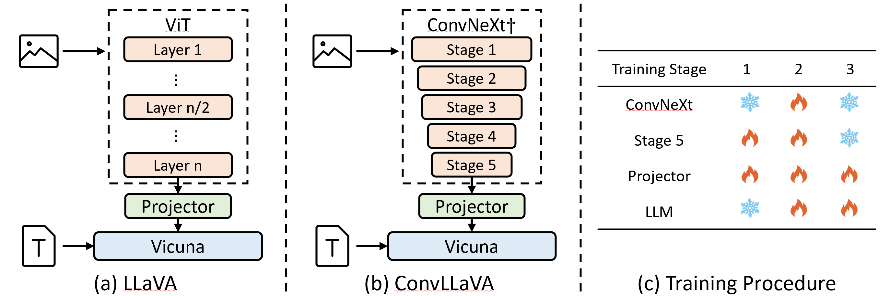

<div align="center">

<h2><a href="https://github.com/alibaba/conv-llava">ConvLLaVA: Hierarchical Backbones as Visual Encoder for Large Multimodal Models</a></h2>

[Chunjiang Ge](https://john-ge.github.io/), [Sijie Cheng](https://adacheng.github.io/), Ziming Wang, Jiale Yuan, Yuan Gao

Jun Song, Shiji Song, [Gao Huang](https://www.gaohuang.net/), Bo Zheng

</div>

<p align="center">
    <a href="http://arxiv.org/abs/2405.15738"> 
        
    </a>
    <a href="https://huggingface.co/collections/ConvLLaVA/convllava-66519ef0ccdee62544bd19bf"> 
        
    </a>
    <a href="https://huggingface.co/papers/2405.15738"> 
        
    </a>
    <a href="https://modelscope.cn/organization/ConvLLaVA?tab=model"> 
        
    </a>
    <a href="https://wisemodel.cn/organization/ConvLLaVA"> 
        
    </a>
    <a href="https://github.com/alibaba/conv-llava/blob/main/asset/WeChat.png"> 
        
    </a>
    <a href="https://github.com/alibaba/conv-llava/stargazers">
        
    </a>
</p>

<span>[ <a href="README.md"> English </a> | 中文 ]</span>

## 摘要 :bulb:

高分辨率多模态大模型（LMM）面临视觉token过多和视觉平方复杂度的挑战。当前的高分辨率LMM通常能够解决二次复杂度问题，却会生成过量的视觉token。**然而，过多的视觉token才是更关键的问题，因为它会导致更显著的计算开销。** 为了解决这个问题，我们提出了ConvLLaVA，它采用层次化的主干网络ConvNeXt作为LMM的视觉编码器，以替代Vision Transformer（ViT）。**ConvLLaVA将高分辨率图像压缩成富含信息的视觉特征，有效避免了生成过多的视觉token。** 为了增强ConvLLaVA的能力，我们提出了两项关键优化措施。

- 由于低分辨率预训练的ConvNeXt在直接应用于高分辨率时表现不佳，**我们更新它以弥合这一差距。**
- 此外，由于ConvNeXt原有的压缩比对于更高分辨率的输入来说不足，**我们训练了一个新的stage，以进一步压缩视觉token**，有效减少冗余。

**这些优化使得ConvLLaVA能够支持1536x1536分辨率的输入，同时仅生成576个视觉token，并适应任意宽高比的图像。** [实验结果](#model-zoo)显示，我们的方法在主流基准测试上与最先进的模型相比取得了竞争性的性能。

<div align="center">
  
</div>
<div align="center">
  <figcaption> LLaVA 和 ConvLLaVA 结构上的对比</figcaption>
</div>


[](mailto:gecj20@mails.tsinghua.edu.cn)
如果你对多模态大模型感兴趣，或者你有很好的想法，请你联系我：[Chunjiang Ge](mailto:gecj20@mails.tsinghua.edu.cn).

[](https://github.com/tatsu-lab/stanford_alpaca/blob/main/LICENSE)
**Usage and License Notices**: This project utilizes certain datasets and checkpoints that are subject to their respective original licenses. Users must comply with all terms and conditions of these original licenses, including but not limited to the [OpenAI Terms of Use](https://openai.com/policies/terms-of-use) for the dataset and the specific licenses for base language models for checkpoints trained using the dataset (e.g. [Llama community license](https://ai.meta.com/llama/license/) for LLaMA-2 and Vicuna-v1.5). This project does not impose any additional constraints beyond those stipulated in the original licenses. Furthermore, users are reminded to ensure that their use of the dataset and checkpoints is in compliance with all applicable laws and regulations.

## 内容
- [摘要 :bulb:](#摘要-bulb)
- [内容](#内容)
- [计划](#计划)
- [安装](#安装)
- [模型库](#模型库)
- [数据集](#数据集)
- [训练](#训练)
- [评测](#评测)
- [引用](#引用)
- [致谢](#致谢)

## 计划

- [ ] Add [LMMs-eval](https://github.com/EvolvingLMMs-Lab/lmms-eval) supports.
- [ ] Add [VLMEvalKit](https://github.com/open-compass/VLMEvalKit) supports.
- [ ] Add [xtuner](https://github.com/InternLM/xtuner) supports.
- [x] Release weights.
- [ ] Release inference code.

## 安装

1. Clone this repository and navigate to ConvLLaVA folder
```bash
git clone https://github.com/alibaba/conv-llava
cd conv-llava
```

1. Install Package
```bash
conda create -n convllava python=3.11 -y
conda activate convllava
pip install --upgrade pip  # enable PEP 660 support
pip install -e .
```

3. Install additional packages for training cases
```bash
pip install -e ".[train]"
pip install flash-attn --no-build-isolation
```

## 模型库

我们的模型的在一些测试基准上的性能如下：

<table class="tg"><thead>
  <tr>
    <th class="tg-nrix">Method</th>
    <th class="tg-nrix">Resolution</th>
    <th class="tg-nrix">Visual Tokens</th>
    <th class="tg-nrix">LLM</th>
    <th class="tg-nrix">MME</th>
    <th class="tg-nrix">MMB</th>
    <th class="tg-nrix">SEED</th>
    <th class="tg-nrix">RealWorldQA</th>
    <th class="tg-nrix">MMMU</th>
    <th class="tg-nrix">MMVet</th>
    <th class="tg-nrix">Text</th>
    <th class="tg-nrix">Doc</th>
    <th class="tg-nrix">POPE</th>
  </tr></thead>
<tbody>
  <tr>
    <td class="tg-nrix">ConvLLaVA</td>
    <td class="tg-nrix">768</td>
    <td class="tg-nrix">144</td>
    <td class="tg-nrix">7B</td>
    <td class="tg-nrix">1541</td>
    <td class="tg-nrix">68</td>
    <td class="tg-nrix">68.8</td>
    <td class="tg-nrix">55.9</td>
    <td class="tg-nrix">36.3</td>
    <td class="tg-nrix">44.8</td>
    <td class="tg-nrix">59.1</td>
    <td class="tg-nrix">44.8</td>
    <td class="tg-nrix">87.3</td>
  </tr>
  <tr>
    <td class="tg-nrix">ConvLLaVA</td>
    <td class="tg-nrix">1024</td>
    <td class="tg-nrix">256</td>
    <td class="tg-nrix">7B</td>
    <td class="tg-nrix">1553</td>
    <td class="tg-nrix">68.8</td>
    <td class="tg-nrix">69.3</td>
    <td class="tg-nrix">58.8</td>
    <td class="tg-nrix">35.1</td>
    <td class="tg-nrix">44.4</td>
    <td class="tg-nrix">62.5</td>
    <td class="tg-nrix">48.5</td>
    <td class="tg-nrix">87.7</td>
  </tr>
  <tr>
    <td class="tg-nrix">ConvLLaVA</td>
    <td class="tg-nrix">1536</td>
    <td class="tg-nrix">576</td>
    <td class="tg-nrix">7B</td>
    <td class="tg-nrix">1575</td>
    <td class="tg-nrix">68.7</td>
    <td class="tg-nrix">70.2</td>
    <td class="tg-nrix">59.9</td>
    <td class="tg-nrix">35.8</td>
    <td class="tg-nrix">45.9</td>
    <td class="tg-nrix">65.8</td>
    <td class="tg-nrix">59</td>
    <td class="tg-nrix">87.3</td>
  </tr>
</tbody></table>

<table class="tg"><thead>
  <tr>
    <th class="tg-nrix" rowspan="2">Method</th>
    <th class="tg-nrix" rowspan="2">Resolution</th>
    <th class="tg-nrix" rowspan="2">Visual Tokens</th>
    <th class="tg-nrix" rowspan="2">LLM</th>
    <th class="tg-nrix" colspan="3">RefCOCO</th>
    <th class="tg-nrix" colspan="3">RefCOCO+</th>
    <th class="tg-nrix" colspan="2">RefCOCOg</th>
    <th class="tg-nrix" rowspan="2">Avg</th>
  </tr>
  <tr>
    <th class="tg-nrix">val</th>
    <th class="tg-nrix">test-A</th>
    <th class="tg-nrix">test-B</th>
    <th class="tg-nrix">val</th>
    <th class="tg-nrix">test-A</th>
    <th class="tg-nrix">test-B</th>
    <th class="tg-nrix">val</th>
    <th class="tg-nrix">test</th>
  </tr></thead>
<tbody>
  <tr>
    <td class="tg-nrix">ConvLLaVA</td>
    <td class="tg-nrix">768</td>
    <td class="tg-nrix">144</td>
    <td class="tg-nrix">7B</td>
    <td class="tg-nrix">84.5</td>
    <td class="tg-nrix">89.0</td>
    <td class="tg-nrix">79.2</td>
    <td class="tg-nrix">77.7</td>
    <td class="tg-nrix">84.9</td>
    <td class="tg-nrix">69.7</td>
    <td class="tg-nrix">79.8</td>
    <td class="tg-nrix">79.7</td>
    <td class="tg-nrix">80.6</td>
  </tr>
  <tr>
    <td class="tg-nrix">ConvLLaVA</td>
    <td class="tg-nrix">1024</td>
    <td class="tg-nrix">256</td>
    <td class="tg-nrix">7B</td>
    <td class="tg-nrix">85.5</td>
    <td class="tg-nrix">89.6</td>
    <td class="tg-nrix">78.8</td>
    <td class="tg-nrix">79.3</td>
    <td class="tg-nrix">86.1</td>
    <td class="tg-nrix">70.3</td>
    <td class="tg-nrix">80.6</td>
    <td class="tg-nrix">81.2</td>
    <td class="tg-nrix">81.4</td>
  </tr>
  <tr>
    <td class="tg-nrix">ConvLLaVA</td>
    <td class="tg-nrix">1536</td>
    <td class="tg-nrix">576</td>
    <td class="tg-nrix">7B</td>
    <td class="tg-nrix">86.5</td>
    <td class="tg-nrix">90.6</td>
    <td class="tg-nrix">80.5</td>
    <td class="tg-nrix">80.0</td>
    <td class="tg-nrix">86.8</td>
    <td class="tg-nrix">71.5</td>
    <td class="tg-nrix">82.0</td>
    <td class="tg-nrix">82.4</td>
    <td class="tg-nrix">82.3</td>
  </tr>
</tbody></table>

我们的 [Model Zoo](https://github.com/alibaba/conv-llava/blob/main/docs/Model_zoo.md) 中包含了主要的权重和下载方式，并有说明如何使用这些权重。

## 数据集

我们实验用到的数据在 [Data.md](https://github.com/alibaba/conv-llava/blob/main/docs/Data.md) 中有介绍。

## 训练

训练的超参数如下：

| Hyperparameters | Stage 1 | Stage 2 | Stage 3 |
| --------------- | ------- | ------- | ------- |
| Learning Rate   | 3e-4    | 2e-5    | 2e-5    |
| Batch Size      | 256     | 256     | 128     |
| Epochs          | 1       | 1       | 1       |
| Warmup Ratio    | 0.03    | 0.03    | 0.03    |
| Weight Decay    | 0       | 0       | 0       |
| Optimizer       | AdamW   | AdamW   | AdamW   |

训练脚本在文件夹 [scripts](https://github.com/alibaba/conv-llava/tree/main/scripts) 中:

- Projector Initialzation: [stage1](https://github.com/alibaba/conv-llava/tree/main/scripts/stage_1.sh)
- Vision Language Pretraining: [stage2](https://github.com/alibaba/conv-llava/tree/main/scripts/stage_2.sh)
- Instruction Tuning: [stage3](https://github.com/alibaba/conv-llava/tree/main/scripts/stage_3.sh)

## 评测

我们目前支持 [VLMEVALKIT](https://github.com/open-compass/VLMEvalKit) 和 [lmms-eval](https://github.com/EvolvingLMMs-Lab/lmms-eval) 来测试模型。请看 [Evaluation.md](https://github.com/alibaba/conv-llava/blob/main/docs/Evaluation.md) 了解更多细节.

## 引用

如果你认为我们的工作有所帮助，请你通过下面的 BibTeX 来引用我们的工作:

```bibtex
@misc{ge2024convllava,
    title={ConvLLaVA: Hierarchical Backbones as Visual
Encoder for Large Multimodal Models},
    author={Chunjiang Ge, Sijie Cheng, Ziming Wang, Jiale Yuan, Yuan Gao, Jun Song, Shiji Song, Gao Huang, Bo Zheng},
    archivePrefix={arXiv},
    primaryClass={cs.CV}
    year={2024}
    eprint={2045.15738},
}
```

## 致谢

- [Vicuna](https://github.com/lm-sys/FastChat): the codebase LLaVA built upon, and our base model Vicuna-13B that has the amazing language capabilities!
- [LLaVA](https://github.com/haotian-liu/LLaVA): the codebase we built upon.
